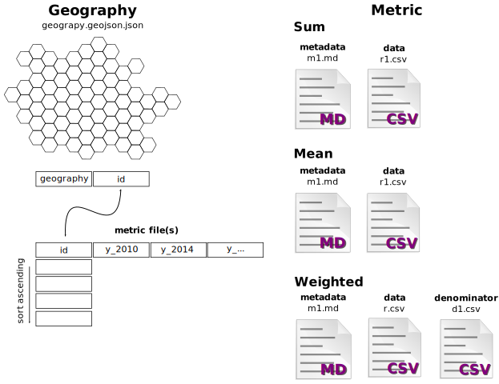

# Mecklenburg County Quality of Life Data

<p>
  
  
  
  <a href="https://github.com/tobinbradley/mecklenburg-quality-of-life-data#readme">
    
  </a>
  <a href="https://github.com/tobinbradley/mecklenburg-quality-of-life-data/graphs/commit-activity">
    
  </a>
  <a href="https://github.com/tobinbradley/mecklenburg-quality-of-life-data/blob/master/LICENSE">
    
  </a>
  <a href="https://twitter.com/fuzzytolerance">
    
  </a>
</p>

> data for the quality of life dashboard

### 🏠 [Homepage](https://github.com/tobinbradley/mecklenburg-quality-of-life-data#readme)

## Prerequisites

- npm >=5.5.0
- node >=9.3.0

## Install

Note install is only needed to run the test suite.

```sh
npm install
```

## Run tests

```sh
npm run test --silent
```

## Using this repo with your own data



This repo is designed to be used with the [Quality of Life Dashboard](https://github.com/tobinbradley/quality-of-life-dashboard). The idea is you could drop in a data repo from any area or organization and it would "Just Work".

There are four steps to customizing this repo with your own data: create your geography, create your data file(s), create your meta data, and update the configuration files.

## Create Geography

The first thing you'll need is your geography in GeoJSON. Your geography:

- Lives in `/geography`.
- Must be WGS84 (EPSG:4326).
- Must contain an `id` property that's a **string** and a **unique identifier** for each polygon. This `id` is the primary key between the geography and the data files.

Some tips for your geography:

* It's a good practice for the file extension be `.json` rather than `.geojson`, as your web serve and consuming clients are more likely be be familiar with the former.
* **Drop any fields that aren't `id`**. They won't be used and will add file bloat.
* To speed file delivery and processing time, you should generalize the polygons. A common workflow would be to export your geography with [QGIS](https://www.qgis.org/en/site/) and simplify your polygons with [mapshaper](https://mapshaper.org/). Ideally, your geography should be less than 400KB. The smaller the better.

## Create Data Files

Data files are CSV's located in `/data`. The format is:

```csv
id,y_2000,y_2010
neighborhood1,23,432
neighborhood2,,100
```

* The `id` column matches the `id` column in the geography.
* The file needs to be sorted on the `id` column.
* The column header for each year available is `y_<year>`, i.e. `y_2010`. Years should be in order from oldest to newest.
* No data should be represented by no characters, like `neighborhood2,,100`

The file will be named `r<id>.csv`. The `id` is a unique metric identifier (I use a number). You'll use this number to specify configuration options for the metric later.

You have the option of doing a weighted calculation when selecting more than one polygon. In that case, you'd have a raw value

The type of data will decide the files required:

- `sum`: The data is summed when polygons are selected. This will require a `r<metric>.csv` file.
- `mean`: The data is averaged when polygons are selected. This will require a `n<metric>.csv` file.
- `weighted`: A weighted average is calculated when polygons are selected. This requires the raw data in `r<metric>.csv` and a denominator for weighting/calculations in `d<metric>.csv`. r/d is each individual polygon value.

After creating your data files, run the test suite to make sure the basics check out.

```bash
npm run test --silent
```

## Create Metadata

Metadata files in markdown format are located in `/meta`. Each metadata file is named in format `m<metric number>.md`. You can put anything you want in your meta. When displayed in the Quality of Life Explorer it is converted to HTML with [marked](https://github.com/markedjs/marked).


## Update Configuration Files

There are two configuration files: `data.js` and `options.js`. Some items in these files will be related (i.e. you would name a non-default color scheme for a metric in data.js, and the color scheme is defined in options.js). 

### `data.js`

This file is an array of configuration objects, one for each metric. There are a variety of options to set here, but only 4 are required.

```javascript
{
  // REQUIRED
  // Unique identifier for the metric. Matches the id in the metric file name.
  "metric": "1",
  // REQUIRED
  // What to call this metric
  "title": "Age of Residents",
  // REQUIRED
  // The type of operation to be performed when more than one polygon is selected.
  // options are "sum", "mean", and "weighted"
  "type": "weighted",
  // REQUIRED
  // Array of tags to apply to the metric
  "tags": ["demographics", "economy"],
  // OPTIONAL
  // The name of the geojson file to use if not the default
  "geojson": 'tracts.geojson.json',
  // OPTIONAL
  // The color scheme to use if not the default
  "colors": 'orange',
  // OPTIONAL
  // Array of objects describing fixed data points to list
  // as a comparison 
  "comparables": [
    {
      name: 'Philadelphia (2018)',
      val: '5'
    }
  ],
  // OPTIONAL
  // indicates accuracy data available
  "accuracy": "true",
  // OPTIONAL
  // number of decimal places to display (default is 0)
  "decimals": 1,
  // OPTIONAL
  // prefix for number display
  "prefix": "$",
  // OPTIONAL
  // suffix for number display
  "suffix": "%",
  // OPTIONAL
  // metric unit information
  "label": "Years",
  // OPTIONAL
  // label for raw number of a weighted metric
  // if this value isn't set, the raw number of a weighted metric will not be displayed
  "raw_label": "units",
  // OPTIONAL
  // override total geography value for specific errors
  // useful if the rounding involved drives you crazy
  "world_val": {
    "y_2015": 35
  }
}
```

### `options.js`

This object contains configuration options for the map, GeoJSON files, and other things.

```javascript
{
  // OPTIONAL
  // The maximum boundary of your base tiles. The default is the world.
  maxBounds: [[-82.641, 34.115], [-79.008, 36.762]],
  // REQUIRED
  // The default geojson file to use if a metric does not specify a different one
  defaultgeojson: 'npa.geojson.json',
  // REQUIRED
  // Array of objects information about GeoJSON layers used
  geojson: [
    {
      // REQUIRED
      // the file name
      layer: 'npa.geojson.json',
      // REQUIRED
      // Name of the geographic unit
      name: 'NPA',
      // REQUIRED
      // Description of the geographic unit
      description:
        'Neighborhood Profile Areas (NPAs) are geographic areas used for the organization and presentation of data in the Quality of Life Study. The boundaries were developed with community input and are based on one or more Census block groups.',
      // OPTIONAL
      // Array of objects describing groups to compare to selected groups
      // i.e., a city or political district within the county your data covers
      compareGroups: [
        {
          // REQUIRED
          // What to call this group
          name: 'Charlotte',
          // OPTIONAL
          // A URL call containing an array of ID's contained in this group
          // Format is ["id1", "id2", ...]
          ids: 'groups/npa-jurisdiction-charlotte.json',
          // OPTIONAL
          // A formatting function for the results of the URL call above.
          // Handy if youre using an API and need to translate the return format
          // in to ["id1", "id2", ...]
          format: function(data) {
            return data
          }
        }
      ],
      // OPTIONAL
      // Polygon ID groups used in the select group drop down. Facilitates selecting common groups.
      selectGroups: [
        {
          // REQUIRED
          // What to call the group
          name: 'Charlotte',
          // REQUIRED
          // A URL call containing an array of ID's contained in this group
          // Format is ["id1", "id2", ...]
          ids: 'groups/npa-jurisdiction-charlotte.json',
          // OPTIONAL
          // A formatting function for the results of the URL call above.
          // Handy if youre using an API and need to translate the return format
          // in to ["id1", "id2", ...]
          format: function(data) {
            return data
          }
        }
      ],
      // REQUIRED
      // Array of objects describing additional URL calls for the search
      // that are specific to the geojson.  
      // Leave an empty array if none needed.
      searchPaths: []
    }    
  ],
  // REQUIRED
  // Array of objects describing additional URL calls for the search. 
  // Leave an empty array to only searches for matching polygon id's.
  searchPaths: [
    {
      // REQUIRED
      // Name of the search
      name: 'address',
      // REQUIRED
      // URL of the search API
      // The return can be of two types. 
      // For a point location: [{"label": "5501 Ruth Dr", "lnglat": "xcoord,ycoord"}, ...]
      // For a list of id's to select: [{"label": "Zipcode 28031", "id": ["id1", "id2"]}]
      url:
        "https://mcmap.org/api2/v1/query/master_address_table?columns=full_address%20as%20label%2C%20ST_X(ST_Transform(the_geom%2C%204326))%20%7C%7C%20'%2C'%20%7C%7C%20ST_Y(ST_Transform(the_geom%2C%204326))%20as%20lnglat&limit=5&filter=cde_status%3D'A'%20and%20num_x_coord%20%3E%200%20and%20ts%20%40%40%20to_tsquery('addressing_en'%2C'",
      // OPTIONAL
      // Any special formatting that needs to be done to the query parameter
      searchVal: function(val) {
        return encodeURIComponent(
          val
            .trim()
            .toUpperCase()
            .replace(/ /g, '&') + ":*')"
        )
      },
      // OPTIONAL
      // Format function to transform API data into one of the required formats
      format: function(data) {
        return data
      }
    }    
  ],
  // REQUIRED
  // The MapBox GL style to be used with the base tiles.
  // Positron-Mecklenburg is based on openmaptiles positron-gl-style
  // https://github.com/openmaptiles/positron-gl-style
  style: 'positron-mecklenburg.json',
  // REQUIRED
  // The name of the GL style layer to insert the polygons before
  fillLayerBefore: 'building',
  // REQUIRED
  // The name of the GL style layer to insert the polygon boundaries before
  lineLayerBefore: 'place_other',
  // REQUIRED
  // List of color schemes to use
  // The number of colors determines the number of breaks
  // The only required color scheme is "default".
  // Default is used for all metrics unless a metric configuration specifies a different one
  colors: {
    default: ['#f0f9e8', '#bae4bc', '#7bccc4', '#43a2ca', '#0868ac'],
    RdPu6: ['#feebe2', '#fcc5c0', '#fa9fb5', '#f768a1', '#c51b8a', '#7a0177'],
    YLGN6: ['#ffffcc', '#d9f0a3', '#addd8e', '#78c679', '#31a354', '#006837'],
    orange: [ '#feedde', '#fdd0a2', '#fdae6b', '#fd8d3c', '#f16913', '#d94801', '#8c2d04' ]
  },
  // REQUIRED
  // Array of arrays of metric id's to make the default that appear on a new page load
  // If more than one array is given, one set will be chosen at random
  defaultMetrics: [['27', '100', '2']],
  // OPTIONAL
  // Allows the ability to highlight recently added or updated metrics
  whatsnew: [ '28', '36', '45', '46', '47', '62' ]
}
```


In particular, you will also want to change the Mapbox GL JS `/gl-style/style.json` pointer in `main.js` to your own tiles, Mapbox tiles, OSM2VectorTiles tiles, or what have you. The tiles we use don't cover much of the planet beyond our needs. The excellent [OSM-Liberty](https://github.com/lukasmartinelli/osm-liberty) is provided as a drop-in replacement.

### Tips and Gotchas

#### CSV column case sensitivity

Spreadsheet software often likes to capitalize the first letter in the `y_XXXX` field. That will turn your life into a furious ball of nothing. On a 'nix machine you can fix your files automatically via `npm run clean-csv`.

#### Sort on the ID

Your CSV files should be sorted on the metric ID. On a 'nix machine you can sort them automatically via `npm run clean-csv`.

#### Make sure ID's are treated as strings

Some identifiers like Census tracts can have a hanging zero, like 541.10. If you are manipulating your data files in spreadsheet software, make sure your ID column is being treated as a string and not a number or it will get dropped and your life will be destroyed.

## Author

👤 **Tobin Bradley**

* Twitter: [@fuzzytolerance](https://twitter.com/fuzzytolerance)
* Github: [@tobinbradley](https://github.com/tobinbradley)

## 🤝 Contributing

Contributions, issues and feature requests are welcome!<br />Feel free to check [issues page](https://github.com/tobinbradley/mecklenburg-quality-of-life-data/issues).

## Show your support

Give a ⭐️ if this project helped you!

## 📝 License

Copyright © 2019 [Tobin Bradley](https://github.com/tobinbradley).<br />
This project is [MIT](https://github.com/tobinbradley/mecklenburg-quality-of-life-data/blob/master/LICENSE) licensed.

***
_This README was generated with ❤️ by [readme-md-generator](https://github.com/kefranabg/readme-md-generator)_